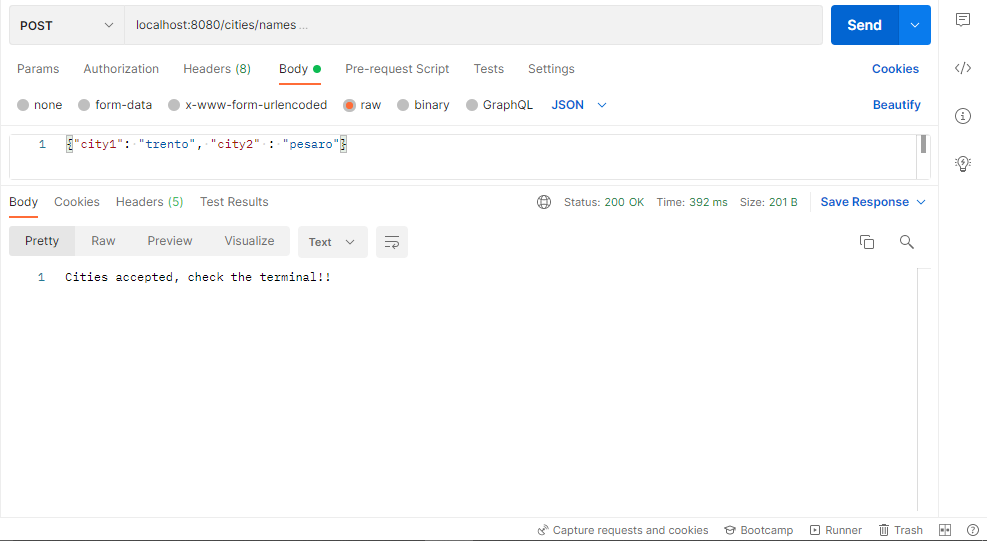
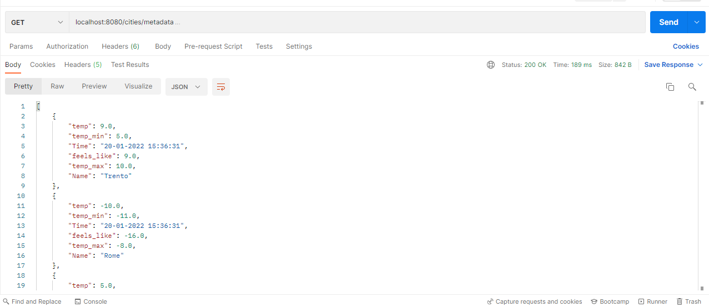
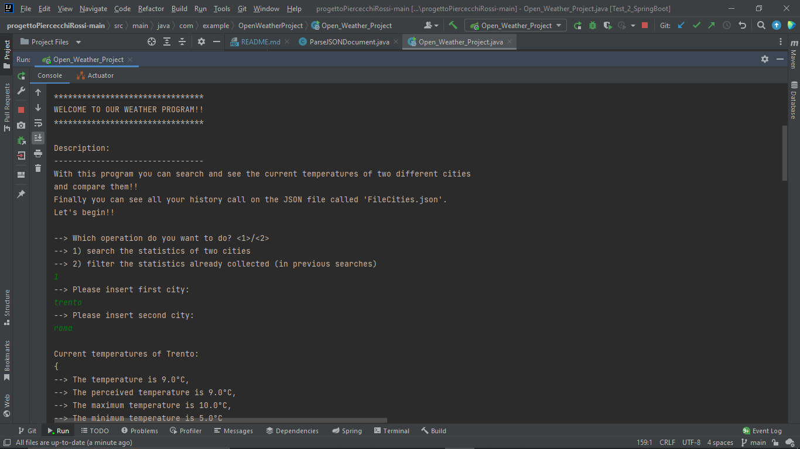

#### ENGLISH VERSION

# OpenWeatherApplication

##### INTRODUCTION

<div style="text-align: justify">
This file README.md aims to present and explain step by step the development of the exam project of *Object Oriented Programming* for the session of January 24, 2022.

The main purpose of this project is to develop a Java application that makes a comparative analysis of statistical data (minimum, maximum, average and variance values of perceived and effective temperature values) concerning the weather information of two cities entered by the user via the terminal.
</div>

##### API

<div style="text-align: justify">
The implemented API is **Current OpenWeather**, and the call to this API has the following structure:

https://api.openweathermap.org/data/2.5/weather?q={city%20name}&appid={API%20key}

* {city%20name} represents the name of the city;
* {API%20key} represents the code needed to access the OpenWeather service.

*Eg.* By calling the API through the *HTTP GET* method:

https://api.openweathermap.org/data/2.5/weather?q=roma&appid=14bbc528b3c2df06e94336bd503ddc1a

you get the following data in <code>*.json*</code> format.

```json
{
"coord": {
"lon": 12.4839,
"lat": 41.8947
},
"weather": [
{
"id": 800,
"main": "Clear",
"description": "clear sky",
"icon": "01d"
}
],
"base": "stations",
"main": {
"temp": 287,
"feels_like": 285.98,
"temp_min": 284.89,
"temp_max": 289.07,
"pressure": 1024,
"humidity": 59
},
"visibility": 10000,
"wind": {
"speed": 0.51,
"deg": 0
},
"clouds": {
"all": 0
},
"dt": 1642346153,
"sys": {
"type": 2,
"id": 2037790,
"country": "IT",
"sunrise": 1642314890,
"sunset": 1642349055
},
"timezone": 3600,
"id": 6539761,
"name": "Roma",
"cod": 200
}
```

Thanks to the use of this API it was possible to obtain the live data necessary for our project:

* <code>name</code> name of the city requested
* <code>main</code> which contains:
    * <code>temp</code> current temperature
    * <code>feels_like</code> perceived temperature
    * <code>temp_min</code> minimum temperature
    * <code>temp_max</code> maximum temperature
</div>

##### RUNNING

<div style="text-align: justify">
The three main functionality are:

* provide single and comparative statistics of the cities entered by the user;
* save the data obtained in the appropriate <code>*.json*</code> format file;
* return the data collected in a specific period of time chosen by the user.

The operating mechanism of the program is as follows:

1. the <code>Menu</code> class, interfacing with the user via the terminal, collects the data entered by him (the names of the cities);

2. the <code>CityServiceImpl.inputCity(...)</code> method, defined by the <code>CityService</code> interface, uses the data entered by the user to send requests through URI calls, using the OpenWeather API, and receive "in response" the statistics of the cities chosen in <code>*.json*</code> format;

3. the <code>ParseJSONDocument</code> class parses the *JSONObject*, received by the <code>CityServiceImpl.inputCity(...)</code> method, and returns the "parsed" data via the terminal.

4. the <code>CreatingJSONDocument</code> class creates (or updates) the <code>*.json*</code> file by entering the values obtained from the class described in **point 3**. It acts as a database, containing all the statistics of the cities requested by the user;

5. the classes contained in the <code>stats</code> package are used to save and compare the obtained data.

6. finally the classes contained in the <code>filters</code> package, through a request, made by the terminal (entering two dates), filter the collected data.

<br>

>**ADDITIONAL NOTES:** As an additional implementation, the user was given the possibility to enter cities and request the related statistics via HTTP requests.

<br>

This implementation is present in the <code>controller</code> packege:

| Roots            | Description                                                                                                       |
|------------------|-------------------------------------------------------------------------------------------------------------------|
| <code>/cities</code>          | <code>GET</code>: returns the name of all the cities entered (in addition to the first two generated by default); <br> <code>POST</code>: allows you to enter, and then save, the name of a city |
| <code>/cities/{id}</code>     | <code>PUT</code>: allows you to update the name of a city using its unique {id} <br> <code>DELETE</code>: allows you to delete the name of a city using its unique {id} |
| <code>/cities/names</code>    | <code>POST</code>: allows you to enter the name of the two cities for which you want the statistics                             |
| <code>/cities/metadata</code> | <code>GET</code>: returns the data collected in the previous calls (saved in a dedicated <code>*.json*</code> file) |

Examples
</div>

(Example-POST root <code>/cities/names</code>)


(Example-GET root <code>/cities/metadata</code>)


##### HOW TO USE

<div style="text-align: justify">
To use this program you must first clone this repository locally and import the <code>Open-Weather_Project</code> project into the IntelliJ IDE (recommended).

To start the program select <code>Open-Weather_Project</code> in your package explorer and issue the command <code>Run 'OWPSpringBootApplication'</code>.

Once the program has been started, follow the instructions provided by the terminal menu.


</div>

##### POSSIBLE APPLICATIONS

<div style="text-align: justify">
The possible customers who can take advantage of this application are all those individuals / companies whose work is directly or indirectly linked to weather conditions, in particular to temperature.

Examples include agricultural businesses, sectors linked to tourism (travel agencies, ski resorts, etc.), and also research centers (monitoring of climate change, rising seas, etc.).
</div>

##### USED TOOLS (SOFTWARES & LIBRARIES)

* IDE [IntelliJ](https://www.jetbrains.com/idea/) to create the assigned project;
* [PostMan](https://www.postman.com/) to test and finally call the API used (Current OpenWeather);
* Editor [Markdown Monster](https://markdownmonster.west-wind.com/) to write the README.md; 
* [Git](https://git-scm.com/) and [GitHub](https://github.com) for code versioning;
* [Spring](https://spring.io/) Framework, and in particular [Spring Boot](https://spring.io/projects/spring-boot), to speed up the development of the project;
* [JUnit 5](https://junit.org/junit5/) Framework to test the functioning of the various components of the project;
* [JavaDoc](https://www.oracle.com/it/technical-resources/articles/java/javadoc-tool.html), to automatically generate the documentation of the source code (written in Java);
* [<code>org.json</code>](http://www.JSON.org/) library to parse and generate Json files; 
* [Apache Maven](https://maven.apache.org/) library for dependency management;

##### AUTHORS & CONTRIBUTIONS

* [Piercecchi Gabriel](https://github.com/GabrielPiercecchi) (50%): implementation of packages <code>service</code>, <code>menu</code>, <code>controller</code>, and
partly <code>utility</code> (<code>ParseJSONDocument</code> class) and
<code>model</code> (<code>City</code> class);
* [Rossi Alan](https://github.com/AlanRossi01) (50%): implementation of packages <code>stats</code>, <code>filters</code> And
the remaining classes in <code>utilities</code> and <code>model</code> (<code>JSONStructure</code> class).

<br>
<br>

#### VERSIONE ITALIANA

# OpenWeatherApplication

##### INTRODUCTION

<div style="text-align: justify">
Questo file README.md ha lo scopo di presentare e spiegare passo dopo passo lo sviluppo del progetto d'esame di *Programmazione ad Oggetti* per la sessione del 24 gennaio 2022.

L'obbiettivo principale di questo progetto consiste nello sviluppo di un'applicazione Java che esegua un'analisi comparativa dei dati statistici (valori minimo, massimo, medio e varianza dei valori di temperatura percepita ed effettiva) relativi alle informazioni meteorologiche di due città inserite dall'utente tramite il terminale.
</div>

##### API

<div style="text-align: justify">
L'API implementata è **Current OpenWeather**, e la chiamata a tale API presenta la seguente struttura: 

https://api.openweathermap.org/data/2.5/weather?q={city%20name}&appid={API%20key}

* {city%20name} rappresenta il nome della città;
* {API%20key} rappresenta il codice necessario ad accedere al servizio OpenWeather.

*Esempio*

Richiamando attraverso il metodo *HTTP GET* l'API:

https://api.openweathermap.org/data/2.5/weather?q=roma&appid=1234

si ottengono i seguenti dati sotto formato json

```json
{
"coord": {
"lon": 12.4839,
"lat": 41.8947
},
"weather": [
{
"id": 800,
"main": "Clear",
"description": "clear sky",
"icon": "01d"
}
],
"base": "stations",
"main": {
"temp": 287,
"feels_like": 285.98,
"temp_min": 284.89,
"temp_max": 289.07,
"pressure": 1024,
"humidity": 59
},
"visibility": 10000,
"wind": {
"speed": 0.51,
"deg": 0
},
"clouds": {
"all": 0
},
"dt": 1642346153,
"sys": {
"type": 2,
"id": 2037790,
"country": "IT",
"sunrise": 1642314890,
"sunset": 1642349055
},
"timezone": 3600,
"id": 6539761,
"name": "Roma",
"cod": 200
}
```

Grazie all'utilizzo di quest'api è stato possibile ottenere i dati live necessari per il nostro progetto:

* <code>name</code> nome della città richiesta
* <code>main</code> che contiene:
    * <code>temp</code> temperatura corrente
    * <code>feels_like</code> temperatura percepita
    * <code>temp_min</code> temperatura minima
    * <code>temp_max</code> temperatura massima
</div>

##### RUNNING

<div style="text-align: justify">
Le tre funzionalità principali sono:

* fornire le statistiche singole e comparate delle città inserite dall'utente;
* salvare i dati ottenuti nell'apposito file formato <code>*.json*</code>;
* restituire i dati collezionati in un determinato periodo di tempo scelto dall'utente.

Il meccanismo di funzionamento del programma è il seguente:

1. la classe <code>**Menu**</code>, interfacciandosi con l'utente tramite terminale, raccoglie i dati da lui inseriti (i nomi delle città);

2. il metodo <code>**CityServiceImpl.inputCity(...)**</code>, definito dall'interfaccia <code>**CityService**</code>, utilizza i dati inseriti dall'utente per inviare delle richieste tramite delle chiamate URI, sfruttando l'API OpenWeather, e ricevere "in risposta" le statistiche delle città scelte in formato <code>*.json*</code>;

3. la classe <code>**ParseJSONDocument**</code> effettua il parsing del *JSONObject*, ricevuto dal metodo <code>**CityServiceImpl.inputCity(...)**</code>, e restituisce tramite terminale i dati "parsati".

4. la classe <code>**CreatingJSONDocument**</code> crea, o aggiona, il file <code>*.json*</code> inserendo i valori ottenuti dalla classe descritta al **punto 3**. Esso funge da database di tutte le città, con le corrispettive statistiche, richieste dall'utente;

5. le classi e l'interfaccia contenute nel package <code>**stats**</code> servono per salvare e confrontare i dati ottenuti.

6. infine le classi e l'interfaccia contenute nel package <code>**filters**</code>, tramite una richiesta fatta nell'interfaccia del menù (inserimento di due date), filtrano i dati collezionati.

>**NOTE AGGIUNTIVE:** come implementazione aggiuntiva è  stata fornita all'utente la possibilità di inserire le città e richiedere le relative statistiche tramite richieste HTTP.

//

Questa implementazione è rappresentata dal packege <code>controller</code>:

| Roots            | Description                                                                                                       |
|------------------|-------------------------------------------------------------------------------------------------------------------|
| <code>/cities</code>          | <code>GET</code>: restituisce il nome di tutte le città inserite (oltre alle prime due di default);<br><code>POST</code>: permette di inserire, e successivamente salvare, il nome di una città |
| <code>/cities/{id}</code>     | <code>PUT</code>: permette di aggiornare il nome di una città sfruttando il suo {id} univoco<br><code>DELETE</code>: permette di eliminare il nome di una città sfruttando il suo {id} univoco |
| <code>/cities/names</code>    | <code>POST</code>: permette di inserire il nome delle due città di cui si vogliono le statistiche                              |
| <code>/cities/metadata</code> | <code>GET</code>: restituisce i dati collezionati nelle chiamate precedenti (salvati in un file <code>*.json*</code> dedicato) |

Esempi
</div>

(Esempio-POST indirizzo <code>/cities/names</code>)


(Esempio-GET indirizzo <code>/cities/metadata</code>)


##### COME SI USA

<div style="text-align: justify">
Per usare questo programma bisogna innanzitutto clonare questa repository in locale e importare il progetto <code>Open-Weather_Project</code> nell'IDE IntelliJ (consigliato).

Per avviare il programma selezionare <code>Open-Weather_Project</code> nel proprio package explorer e dare il comando <code>Run 'OWPSpringBootApplication'</code>.

All'avvio del programma seguire le indicazioni fornite dal menù da terminale.
   

</div>

##### STRUMENTI UTILIZZATI (SOFTWARE E LIBRERIE)

* IDE [IntelliJ](https://www.jetbrains.com/idea/) per creare il progetto assegnato;
* [PostMan](https://www.postman.com/) per testare e infine richiamare le API utilizzate (Current OpenWeather);
* Editor [Markdown Monster](https://markdownmonster.west-wind.com/) per scrivere il README.md;
* [Git](https://git-scm.com/) e [GitHub](https://github.com) per il versioning del codice;
* Framework [Spring](https://spring.io/), ed in particolare [Spring Boot](https://spring.io/projects/spring-boot), per velocizzare lo sviluppo del progetto;
* Framework [JUnit 5](https://junit.org/junit5/) per testare il funzionamento delle varie componenti del progetto;
* [JavaDoc](https://www.oracle.com/it/technical-resources/articles/java/javadoc-tool.html), per generare automaticamente la documentazione del codice sorgente scritto in Java;
* libreria [<code>org.json</code>](http://www.JSON.org/) per "parsare" e generare Json file;
* libreria [Apache Maven](https://maven.apache.org/) per la gestione delle dipendenze;

##### POSSIBILI APPLICAZIONI

I possibili clienti che possono usufruire di quest'applicazione sono tutti quei privati/aziende il cui lavoro è direttamente o indirettamente legato alle condizioni meteo, in particolare alla temperatura.

Alcuni esempi possono essere le imprese agricole, i settori legati al turismo (...impianti sciistici...), e infine settori legati ai cambiamenti climatici (...innalzamento del livello del mare...).

##### AUTORI E CONTRIBUTI

* [Piercecchi Gabriel](https://github.com/GabrielPiercecchi) (50%): implementazione packages <code>service</code>, <code>menu</code>, <code>controller</code> e 
parzialmente <code>utilities</code> (classe <code>ParseJSONDocument</code>) e
<code>model</code> (classe <code>City</code>);
* [Rossi Alan](https://github.com/AlanRossi01) (50%): implementazione packages <code>stats</code>, <code>filters</code> e 
le restanti classi in <code>utilities</code> e <code>model</code> (classe <code>JSONStructure</code>).
